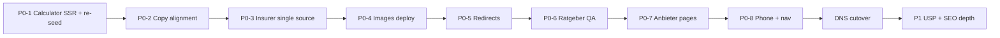

# PRD: Sterbegeld24Plus Launch Gap

> **Stand: 2026-06-13**  
> **Status:** Active — pre-cutover to `sterbegeld24plus.de`  
> **Reference live:** https://www.sterbegeld24plus.de/  
> **Reference preview:** https://leadmonster-kappa.vercel.app/  
> **Related:** [content-strategie-nischen-anbieter.md](./content-strategie-nischen-anbieter.md) §8, [seo-aeo-strategie.md](./seo-aeo-strategie.md)

---

## 1. Problem

LeadMonster preview is **technically ahead** (DB calculator, Convexa leads, schema, author E-E-A-T) but **not ready to replace** the live WordPress site. Users hit empty calculators, inconsistent insurer lists, duplicate blog thumbnails, missing ratgeber heroes, and marketing copy that does not match tariff data.

**Launch bar:** content parity on conversion paths + SEO migration safety — not pixel-perfect design.

---

## 2. Goals

| Goal | Success metric |
|------|----------------|
| Homepage calculator shows real tariffs on first paint | ≥5 Anbieter rows for default input (Jg. ~1960, 8.000 €) |
| Copy matches DB tariffs | No claim >15k sum or “ab 9,99 €” without footnote |
| One insurer source of truth | Same 5 Anbieter on `/`, `/vergleich`, `/vergleichsrechner`, `/tarife` |
| Visual content quality | Unique cover per `/blog` card; ratgeber hero on every article |
| SEO cutover safe | Full 301 map from Screaming Frog crawl before DNS switch |

**Non-goals (P2+):** Variant.com redesign, regional landing pages, Calendly booking, full AI image regen.

---

## 3. User-reported defects (2026-06-13)

| URL | Symptom | Root cause |
|-----|---------|------------|
| `/blog` | All cards show the same image | Prod falls back to `produkte.hero_image_url` per ratgeber; fix in `resolveRatgeberCover` + `lib/stock/curated-covers.ts` **not deployed** |
| `/sterbegeld25/ratgeber/kosten-leistungen` | No header image | No `content.cover_image_url`, no `intro.image_url`; curated fallback **not deployed**; local `resolveRatgeberCover` dropped `intro.image_url` fallback (regression) |

---

## 4. P0 — Launch blockers

Must ship before DNS cutover to `sterbegeld24plus.de`.

### P0-1 · Homepage VergleichsRechner shows tariffs

- [ ] **SSR `initialData`** on embedded `VergleichsRechner` in `ProduktHauptseite` (same as `/vergleichsrechner` page)
- [ ] **Re-seed** `vergleich-tarife-seeds/sterbegeld.csv` — `alter_von`/`alter_bis` are frozen at seed year; drift breaks lookups each January
- [ ] Clamp UI `min_age` / `max_age` in `produkt-config` to **56–81** (matches CSV birth years 1945–1970 in 2026)
- [ ] Verify `produktId` on root `/` resolves to `sterbegeld24plus` UUID (not empty string)

**Acceptance:** https://leadmonster-kappa.vercel.app/ shows DELA, Ideal, Allianz, November, LV1871 without user interaction.

### P0-2 · Marketing copy ↔ tariff data alignment

| Claim (live / generated) | DB reality | Action |
|--------------------------|------------|--------|
| Summe bis 25.000 € | Calculator max 15.000 € | Extend CSV **or** lower claim to 15.000 € |
| Abschluss bis 90 Jahre | Data ~56–81; UI max 86 | Align copy + config |
| „ab 9,99 €“ | Typical senior ~42 €/Monat | Remove or qualify („je nach Alter/Summe“) |

- [ ] Audit hero, features, FAQ, ratgeber CTAs for sterbegeld24plus
- [ ] Single disclaimer under every calculator: *„Werte aus interner Marktbeobachtung…“*

### P0-3 · One insurer list (trust)

Current mismatch:

- `/vergleich` static: Allianz, Volkswohl Bund, Barmenia, AXA, Alte Leipziger  
- `/vergleichsrechner` DB: DELA, Ideal, Allianz, November, LV1871  
- `/tarife` copy: Zurich, Volkswohl Bund, Barmenia  

- [ ] Generate `/vergleich` table from `tarife` WHERE `anbieter_name IS NOT NULL`
- [ ] Remove hard-coded insurer names from `generierter_content` where they contradict DB
- [ ] Footer „Auszug unserer Versicherer“ uses same 5 names

### P0-4 · Blog + ratgeber images

- [ ] Deploy `lib/ratgeber/normalize.ts` → `resolveRatgeberCover()` (curated Unsplash per slug)
- [ ] Restore `intro.image_url` fallback in `resolveRatgeberCover` (regression fix)
- [ ] Batch-assign missing covers: `npx tsx scripts/assign-stock-images.ts sterbegeld24plus` (+ sterbegeld25)
- [ ] Optional later: `npx tsx scripts/regenerate-all-images.ts` when OpenAI key is set

**Acceptance:** `/blog` — no two adjacent cards share the same thumbnail; every published ratgeber has hero grid or curated cover.

### P0-5 · SEO redirects

- [ ] Screaming Frog crawl of live site → redirect CSV
- [ ] Seed `redirects` table: legacy `/hdi/`, `/muenchener-begraebnisverein/`, `/ueber-uns/`, all insurer slugs → `/anbieter/[slug]`
- [ ] Set `NEXT_PUBLIC_BASE_URL=https://www.sterbegeld24plus.de` before cutover

### P0-6 · Ratgeber content quality (top 10)

- [ ] Run `scripts/fix-sterbegeld-ratgeber.ts`
- [ ] Unique `meta_desc` per slug (no shared „Erfahren Sie, was eine Sterbegeldversicherung ist…“)
- [ ] Titles → 2026 (remove „Ratgeber 2024“)
- [ ] Christian review gate on top 10 URLs before bulk publish

### P0-7 · Anbieter deep pages + redirects

- [ ] Minimum pages live: **Allianz, DELA, Ideal, LV1871, HDI, Münchener Begräbnisverein**
- [ ] Each page: AEO lead sentence, DB `besonderheiten` table, Christian practice note, FAQ, CTA
- [ ] 301 from live `/hdi/` etc. already planned — verify after deploy

### P0-8 · Conversion essentials

- [ ] Click-to-call **0731 9727093** in header + sticky mobile bar
- [ ] Nav link **„Tarife vergleichen“** → `/vergleichsrechner`
- [ ] Deploy pending fixes: OpenAI admin key UI, portrait crop, image pipeline (uncommitted)

---

## 5. P1 — Post-launch / week 2

### P1-1 · Missing USP content (live homepage strength)

Live sells variants preview underplays:

- Kapitalversicherung bis 50.000 €  
- Einmalzahlung  
- Abschluss bis 90 Jahre / ohne Unterschrift  
- Überschussbeteiligung  

- [ ] Homepage: one `info_box` or `image_text_split` per variant  
- [ ] Ratgeber: Kapital vs. Sterbegeld, Einmalzahlung, Überschuss (topics exist — need unique copy)

### P1-2 · Long-tail SEO depth

- [ ] Map each live homepage H2 → ratgeber + internal links (prefer ratgeber over 2.000-word homepage)
- [ ] Expand `/wissen/` cross-links from body sections

### P1-3 · Trust polish

- [ ] Insurer logo strip in hero / trust bar  
- [ ] „Warum unabhängiger Makler?“ block (live `/ueber-uns/` story)  
- [ ] Bildnachweise in Impressum (code ready, not deployed)

### P1-4 · Ops

- [ ] OpenAI key in Admin → Einstellungen or Vercel; run full AI image batch  
- [ ] Annual tariff re-seed cron or `geburtsjahr` column migration (stops age drift)  
- [ ] Publication scheduler PRD ([prd-publication-scheduler.md](./prd-publication-scheduler.md)) for ratgeber wave

---

## 6. Implementation order

**This week (agent):** P0-1 + P0-4 code fixes committed and deployed.  
**Christian/Kai:** P0-2 copy review, P0-6 ratgeber approval, P0-5 crawl export.

---

## 7. Test plan

| Check | URL |
|-------|-----|
| Homepage calculator populated | `/` |
| Standalone calculator (baseline) | `/sterbegeld24plus/vergleichsrechner` |
| Unique blog thumbnails | `/blog` |
| Ratgeber hero present | `/sterbegeld25/ratgeber/kosten-leistungen` |
| Insurer consistency | `/vergleich` vs `/vergleichsrechner` |
| Legacy redirect | `/hdi/` → `/anbieter/hdi` |
| Lead E2E | Form submit → Convexa + Resend |

---

## 8. Open decisions

| Question | Owner | Default if no answer |
|----------|-------|----------------------|
| Extend tariffs to 25k or lower marketing claim? | Christian | Lower claim to 15k for launch |
| sterbegeld25 same launch or phase 2? | Denis | Phase 2 — fix shared templates only |
| Stock vs AI images for launch? | Kai | Curated Unsplash now; AI batch post-key |
